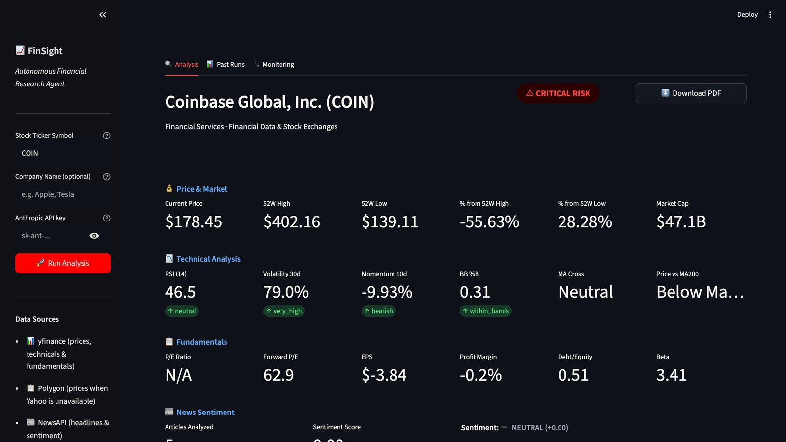
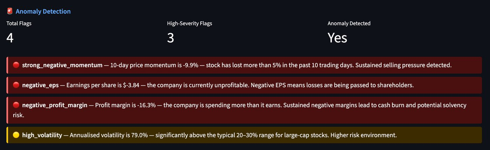
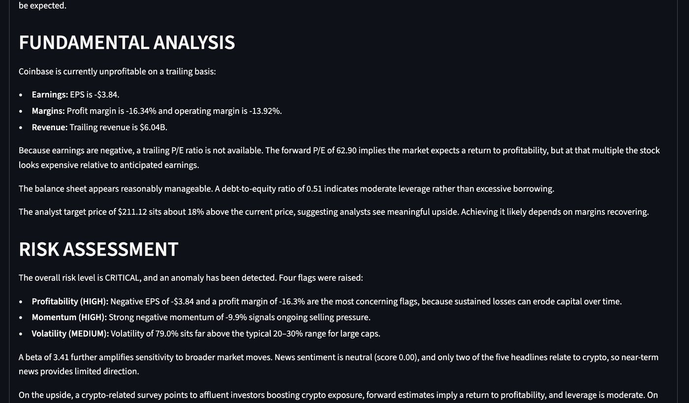
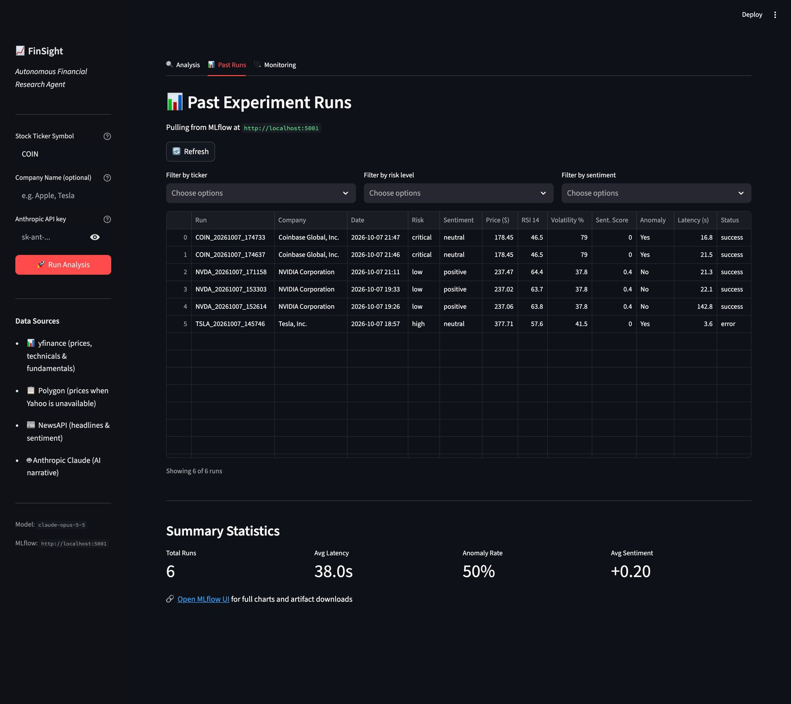
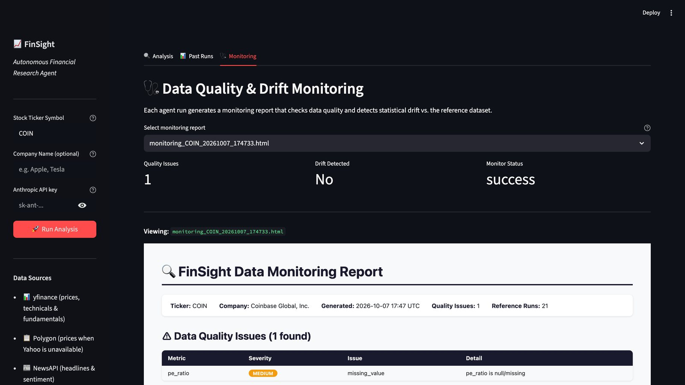
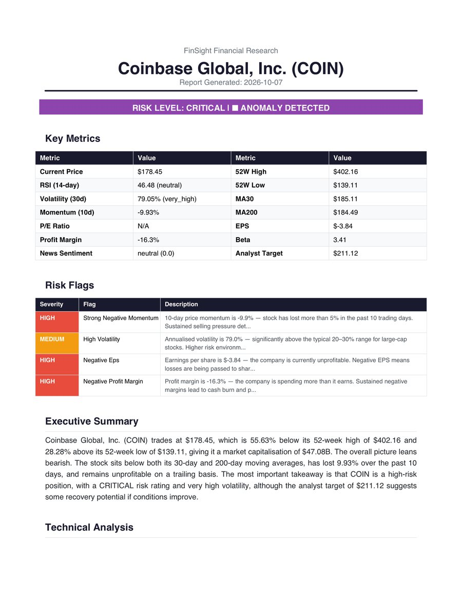
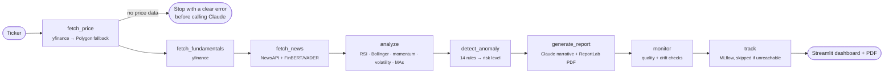

<div align="center">

# 📈 FinSight

### Autonomous Financial Research Agent

**Type a stock ticker. Get technicals, fundamentals, news sentiment, automatic risk flags and a Claude-written research report as a PDF in about 20 seconds.**

[](https://github.com/DEKU-12/finsight-financial-agent/actions/workflows/ci.yml)


[](LICENSE)



</div>

---

## Table of contents

- [Overview](#overview)
- [Features](#features)
- [Screenshots](#screenshots)
- [How it works](#how-it-works)
- [Risk engine](#risk-engine)
- [Tech stack](#tech-stack)
- [Getting started](#getting-started)
- [Configuration](#configuration)
- [Usage](#usage)
- [Deployment](#deployment)
- [MLOps: tracking and monitoring](#mlops-tracking-and-monitoring)
- [Testing and CI](#testing-and-ci)
- [Validation](#validation)
- [Project structure](#project-structure)
- [Known limitations](#known-limitations)
- [Contributing](#contributing)
- [License](#license)
- [Author](#author)

---

## Overview

Researching a stock usually means jumping between a charting site, an earnings page and a news feed, then working out what it all means. FinSight does that in one step.

You enter a ticker such as `COIN` or `NVDA`. A [LangGraph](https://github.com/langchain-ai/langgraph) agent fetches live market data, computes technical indicators in Python, checks the stock against a set of risk rules, scores recent news, and asks Claude to write a structured research report from those numbers. The report is shown in a Streamlit dashboard and saved as a PDF. Every run is logged as an MLflow experiment and checked for data quality and drift.

**Who it's for:** retail investors, finance and data-science students, and anyone who wants a fast, explainable first look at a stock.

> **Disclaimer:** FinSight is an educational project. Nothing it produces is financial advice.

---

## Features

- **🔎 One-ticker research.** Price, 52-week range and market cap, RSI(14), Bollinger Bands, 10-day momentum, 30-day volatility, MA30/MA200 crossovers, P/E, EPS, margins, debt-to-equity, beta and analyst target.
- **🚨 Automatic risk flags.** 14 rule-based checks (death cross, negative EPS, momentum sell-offs, volatility, leverage and more) roll up into a **Low / Medium / High / Critical** risk level, with a plain-English reason for every flag.
- **📰 News sentiment.** Recent headlines from NewsAPI, scored with **FinBERT** (`ProsusAI/finbert`), with automatic fallback to VADER when PyTorch isn't installed.
- **🤖 AI research report.** Claude writes an executive summary plus technical, fundamental and risk sections. The numbers come from the pipeline, and the prompt tells the model not to invent figures.
- **📄 PDF export.** A formatted ReportLab PDF with a key-metrics table, the risk flags and the full narrative.
- **🔑 Bring your own key.** Visitors can paste their own Anthropic API key in the sidebar. It's used only for that session and never logged.
- **📊 Experiment tracking.** Each run is logged to MLflow with parameters, metrics, the PDF, a monitoring report and a JSON snapshot of the agent's state. A **Past Runs** tab lets you browse and filter runs.
- **🩺 Data quality and drift monitoring.** Each run is checked for missing or out-of-range values and compared against a reference dataset of previous runs.
- **☁️ Cloud-ready.** Prices fall back to [Polygon](https://polygon.io) when Yahoo Finance is unavailable (common on cloud hosts). The run stops with a clear message, before any Claude call, if no price data is available. A Render blueprint and a Docker Compose file for MLflow are included.

---

## Screenshots

All screenshots are from one real run on Coinbase (`COIN`), which came back **CRITICAL** with 4 flags, 3 of them high-severity.

| Risk flags | AI research narrative (Claude) |
|---|---|
|  |  |

| Past runs (MLflow) | Data quality and drift monitoring |
|---|---|
|  |  |

<details>
<summary><b>Generated PDF report</b></summary>
<br>

</details>

---

## How it works

FinSight is a LangGraph state machine. Each node reads the shared state and adds its results. All analysis is plain Python, and the LLM is used only to write the narrative.



| Node | What it does |
|---|---|
| `fetch_price` | Company info, current price, 52-week range, volume and one year of daily closes from yfinance. Falls back to Polygon daily bars and ticker details if Yahoo returns nothing. |
| `fetch_fundamentals` | P/E, forward P/E, EPS, margins, ROE, revenue, debt-to-equity, beta, dividend yield and analyst target from yfinance. |
| `fetch_news` | Recent company headlines from NewsAPI, each scored by FinBERT (or VADER as a fallback) and averaged into a sentiment score. |
| `analyze` | RSI(14), Bollinger Bands (20, 2σ) and %B, 10-day momentum, annualised 30-day volatility, MA30/MA200 cross and price-vs-MA signals. |
| `detect_anomaly` | Applies the [risk rules](#risk-engine) and assigns the risk level. |
| `generate_report` | Builds a data-filled prompt, calls Claude, parses the sections and renders the PDF. |
| `monitor` | Writes an HTML data-quality and drift report and appends the run to the reference dataset. |
| `track` | Logs parameters, metrics and artifacts to MLflow. It's skipped quickly when the MLflow server is unreachable, so cloud deploys don't stall. |

---

## Risk engine

Every flag comes with a written explanation in the dashboard and the PDF.

| Flag | Fires when | Severity |
|---|---|---|
| `price_near_52w_high` | Price is within 3% of the 52-week high | Medium |
| `price_near_52w_low` | Price is within 3% of the 52-week low | High |
| `price_outside_bb_upper` | Price is above the upper Bollinger Band | Medium |
| `price_outside_bb_lower` | Price is below the lower Bollinger Band | High |
| `rsi_overbought` | RSI(14) > 70 | Medium |
| `rsi_oversold` | RSI(14) < 30 | Medium |
| `death_cross` | MA30 is below MA200 | High |
| `strong_negative_momentum` | 10-day momentum < −5% | High |
| `high_volatility` | Annualised 30-day volatility > 40% | Medium |
| `volume_spike` | Today's volume > 2× average volume | Medium |
| `negative_eps` | EPS < 0 | High |
| `high_pe_ratio` | P/E > 50 | Medium |
| `high_debt_to_equity` | Debt-to-equity > 2.0 | High |
| `negative_profit_margin` | Profit margin < 0 | High |

**Risk level:**

| Level | Rule |
|---|---|
| 🚨 Critical | 3 or more high-severity flags |
| 🔴 High | At least 1 high-severity flag |
| 🟡 Medium | 2 or more medium-severity flags |
| 🟢 Low | Anything else |

---

## Tech stack

| Layer | Technology |
|---|---|
| Agent framework | LangGraph (+ `langchain-core`) |
| LLM | Anthropic Claude (`claude-opus-5-5` by default) via the official `anthropic` SDK |
| Market data | yfinance, with Polygon as the price fallback |
| News | NewsAPI |
| Sentiment | FinBERT (`ProsusAI/finbert`, Hugging Face Transformers), with VADER as fallback |
| Analysis | pandas, NumPy |
| Reports | ReportLab |
| Experiment tracking | MLflow (SQLite backend, served via Docker Compose) |
| Monitoring | Custom data-quality and drift checks in pandas |
| Frontend | Streamlit |
| CI | GitHub Actions (pytest) |
| Deploy | Render blueprint, Streamlit Community Cloud |

---

## Getting started

### Prerequisites

- **Python 3.11** (3.9+ works locally; CI runs 3.11)
- **API keys:**
  - [Anthropic](https://console.anthropic.com): required to generate reports. You can also paste it in the app's sidebar instead of `.env`.
  - [NewsAPI](https://newsapi.org): required for headlines and sentiment (free developer plan).
  - [Polygon](https://polygon.io) (now Massive): optional locally, recommended for cloud deploys (free plan).
- **Docker** (optional): to run the MLflow server with one command.

### 1. Clone

```bash
git clone https://github.com/DEKU-12/finsight-financial-agent.git
cd finsight-financial-agent
```

### 2. Create a virtual environment and install dependencies

```bash
python3 -m venv .venv
source .venv/bin/activate   # Windows: .venv\Scripts\activate
pip install -r requirements.txt
```

Optional: to enable FinBERT sentiment, install PyTorch (CPU build). Without it, the app uses VADER automatically.

```bash
pip install torch --index-url https://download.pytorch.org/whl/cpu
```

### 3. Add your keys

```bash
cp .env.example .env
```

Then open `.env` and fill in `ANTHROPIC_API_KEY`, `NEWS_API_KEY` and, optionally, `POLYGON_API_KEY`. Keep each key on a single line, without quotes, and don't list the same key twice.

### 4. Start MLflow (optional, enables the Past Runs tab)

With Docker:

```bash
docker compose up -d
```

Or without Docker:

```bash
mlflow server --host 127.0.0.1 --port 5001
```

The app works without MLflow. It hides the Past Runs tab and skips run logging.

### 5. Run the app

```bash
streamlit run app.py
```

Open <http://localhost:8501>, enter a ticker, and click **Run Analysis**.

---

## Configuration

All settings are read from environment variables (or `.env`) in [`config.py`](config.py).

| Variable | Default | Description |
|---|---|---|
| `ANTHROPIC_API_KEY` | — | Claude API key. Optional if users enter their own in the sidebar. |
| `NEWS_API_KEY` | — | **Required.** NewsAPI key. |
| `POLYGON_API_KEY` | — | Price fallback when Yahoo Finance returns nothing. Free tier: 5 calls/minute; each fallback uses 2. |
| `LLM_MODEL` | `claude-opus-5-5` | Claude model used for the report. |
| `LLM_MAX_TOKENS` | `16000` | Max output tokens for the report (includes Claude's thinking). |
| `MLFLOW_TRACKING_URI` | `http://localhost:5000` | MLflow server (`.env.example` uses `http://localhost:5001`, matching Docker Compose). |
| `MLFLOW_EXPERIMENT_NAME` | `finsight-runs` | MLflow experiment name. |
| `REPORTS_DIR` | `data/reports` | Where PDFs and monitoring reports are written. |
| `REFERENCE_DATA_DIR` | `data/reference` | Reference dataset used for drift checks. |
| `RSI_PERIOD` | `14` | RSI lookback. |
| `BB_WINDOW` / `BB_STD` | `20` / `2.0` | Bollinger Band window and width. |
| `ANOMALY_ZSCORE_THRESHOLD` | `2.0` | Logged as an MLflow parameter. The drift checks currently use a fixed threshold of z > 3. |
| `LOG_LEVEL` | `INFO` | Python logging level. |

---

## Usage

1. Enter a ticker (for example `AAPL`, `TSLA` or `COIN`) and, optionally, the company name to sharpen the news search.
2. If no server-side key is configured, paste your Anthropic API key in the sidebar.
3. Click **Run Analysis**. A run takes about 20–30 seconds.
4. Read the dashboard (risk badge, metrics, headlines, flags, AI narrative) and click **Download PDF** for the report.
5. Open **Past Runs** to compare runs, or **Monitoring** to view the latest quality and drift report.

You can also run the agent without the UI:

```python
from agent.graph import run_agent

result = run_agent("NVDA")
print(result["risk_level"], result["flag_count"], result["report_path"])
```

---

## Deployment

### Render

The repo includes a [`render.yaml`](render.yaml) blueprint.

1. On [Render](https://render.com), go to **New → Blueprint** and connect this repository.
2. When prompted, enter `NEWS_API_KEY` and `POLYGON_API_KEY`.
3. Deploy. Render builds with `pip install -r requirements.txt` and starts Streamlit on `$PORT`.

Environment variables added to `render.yaml` after the service exists aren't prompted for again. Add those under **Environment** and redeploy.

### Streamlit Community Cloud

Point a new app at `app.py` on `main` and add your keys under **Settings → Secrets**:

```toml
NEWS_API_KEY = "..."
POLYGON_API_KEY = "..."
LLM_MODEL = "claude-opus-5-5"
```

### Notes for public deploys

- **Leave `ANTHROPIC_API_KEY` unset** so every visitor brings their own key. Otherwise anyone can run reports on yours.
- **Yahoo Finance often blocks cloud servers.** Prices then come from Polygon, but fundamentals (P/E, EPS, margins) will show N/A.
- **No MLflow on the host:** the Past Runs tab is hidden and run logging is skipped.
- **PyTorch is too large for free cloud tiers**, so sentiment uses VADER there.
- **Saved PDFs and reports are wiped** whenever the instance restarts.

---

## MLOps: tracking and monitoring

**MLflow tracking** ([`mlops/tracker.py`](mlops/tracker.py)): each run is logged under the `finsight-runs` experiment.

- **Parameters:** ticker, run date, LLM model, data sources, RSI period, Bollinger window, z-score threshold
- **Metrics:** price, 52-week distance, RSI, volatility, momentum, %B, moving averages, fundamentals, sentiment, flag counts, risk score, LLM tokens and latency, agent latency
- **Tags:** sector, industry, risk level, sentiment, RSI / MA-cross / Bollinger / momentum / volatility signals, report status, anomaly status
- **Artifacts:** the PDF report, the monitoring HTML report, and a JSON snapshot of the agent state

The bundled [`docker-compose.yml`](docker-compose.yml) runs MLflow on port 5001, with a SQLite backend and artifact store in a named Docker volume. Clients upload artifacts over HTTP (`--artifacts-destination`), so logging works from outside the container.

**Monitoring** ([`mlops/monitor.py`](mlops/monitor.py)):

- **Data quality:** missing values and out-of-range checks (price > 0, RSI between 0 and 100, and so on), each with a severity
- **Drift:** each metric is flagged when it sits more than 3 standard deviations from the reference dataset of earlier runs
- **Output:** an HTML report per run, shown in the **Monitoring** tab and logged to MLflow

---

## Testing and CI

```bash
pytest tests/test_nodes.py -v
```

There are 37 tests in [`tests/test_nodes.py`](tests/test_nodes.py), grouped into six classes:

| Class | What it checks |
|---|---|
| `TestFetchPrice` | Price fetch, price validity, MA30/MA200 |
| `TestAnalyze` | RSI range, Bollinger Band ordering, volatility, signals |
| `TestDetectAnomaly` | Flag counts, risk levels, anomaly triggers |
| `TestFetchNews` | Sentiment labels and scores, API error handling (mocked) |
| `TestConfig` | Config imports, attributes and defaults |
| `TestOutputValidation` | Cross-checks agent output against live yfinance data (price within 1%, 52-week bounds, recomputed MA200, realistic RSI and volatility ranges) |

`TestFetchPrice` and `TestOutputValidation` call live yfinance data, so they need network access. NewsAPI calls are mocked.

[GitHub Actions](.github/workflows/ci.yml) runs the suite on Python 3.11 for every push and pull request to `main`.

---

## Validation

### Technical indicators

Indicators were checked against the [`ta`](https://technical-analysis-library-in-python.readthedocs.io/) library across 20 tickers (AAPL, MSFT, NVDA, GOOGL, META, TSLA, AMZN, JPM, JNJ, SPY, QQQ, BAC, PFE, COIN, GS, NFLX, AMD, INTC, DIS, UNH). Results are in [`accuracy_report.txt`](accuracy_report.txt).

| Indicator | Accuracy |
|---|---|
| RSI(14) | 99.99% |
| Bollinger upper band | 99.75% |
| Bollinger lower band | 99.64% |
| MA30 | 100.00% |
| MA200 | 100.00% |
| **Overall** | **99.88%** |

```bash
pip install ta
python scripts/measure_accuracy.py
```

### Sentiment classifier

Three classifiers were compared on 89 real financial headlines from 20 stocks:

| Version | Classifier | Compared with | Agreement | Finding |
|---|---|---|---|---|
| v1 | Keyword matching | VADER | 58.4% | Positivity bias; missed negation and context |
| v2 | VADER | FinBERT | 38.6% | Domain mismatch: VADER labels 65% of financial headlines positive, FinBERT 19% |
| **v3** | **FinBERT** | — | — | Current classifier, fine-tuned on financial text |

Words like *earnings*, *buying* and *bull* are positive in everyday text but often neutral in financial news, which is why FinBERT is the default.

```bash
pip install transformers torch vaderSentiment
python scripts/measure_sentiment_accuracy.py
```

---

## Project structure

```
finsight-financial-agent/
├── app.py                      # Streamlit UI: Analysis, Past Runs, Monitoring tabs
├── config.py                   # Settings loaded from environment / .env
├── agent/
│   ├── graph.py                # LangGraph pipeline, state schema, run_agent()
│   ├── prompts.py              # Report prompt template
│   └── nodes/
│       ├── fetch_price.py      # yfinance prices + Polygon fallback
│       ├── fetch_fundamentals.py
│       ├── fetch_news.py       # NewsAPI + FinBERT / VADER sentiment
│       ├── analyze.py          # RSI, Bollinger Bands, momentum, volatility, MAs
│       ├── detect_anomaly.py   # Risk rules and risk level
│       └── generate_report.py  # Claude call + ReportLab PDF
├── mlops/
│   ├── tracker.py              # MLflow logging
│   └── monitor.py              # Data quality and drift reports
├── scripts/
│   ├── measure_accuracy.py             # Indicator validation vs. `ta`
│   └── measure_sentiment_accuracy.py   # Sentiment benchmark
├── tests/
│   └── test_nodes.py           # pytest suite
├── data/reports/               # Generated PDFs and monitoring reports
├── docs/screenshots/           # Images used in this README
├── docker-compose.yml          # MLflow server
├── render.yaml                 # Render blueprint
├── .github/workflows/ci.yml    # GitHub Actions CI
├── .devcontainer/              # GitHub Codespaces / Dev Container setup
├── .env.example                # Environment variable template
└── requirements.txt
```

---

## Known limitations

- **Cloud data access:** Yahoo Finance often blocks shared cloud IPs. Prices fall back to Polygon, but fundamentals are unavailable on those hosts.
- **News relevance:** NewsAPI keyword search sometimes returns unrelated headlines, which can dilute the sentiment score.
- **Dollar signs in the narrative:** Streamlit's Markdown renders paired `$` signs as LaTeX, so some amounts in the on-screen narrative display as italic math. The PDF is unaffected.
- **Free-tier rate limits:** NewsAPI's developer plan and Polygon's free plan (5 calls/minute) limit how many analyses you can run back to back.
- **Rule-based risk:** risk levels come from fixed thresholds, not a trained model. They're a starting point for research, not a recommendation.

---

## Contributing

Issues and pull requests are welcome.

1. Fork the repo and create a branch: `git checkout -b feature/my-change`
2. Make your change and add or update tests.
3. Run `pytest tests/test_nodes.py -v`.
4. Open a pull request describing what changed and why.

Please never commit `.env` or API keys.

---

## License

Released under the [MIT License](LICENSE).

---

## Author

**Ayush**, MS Data Science, George Washington University

- GitHub: [@DEKU-12](https://github.com/DEKU-12)
- Email: ayush120320@gmail.com

### Acknowledgements

- [ProsusAI/finbert](https://huggingface.co/ProsusAI/finbert) and Malo et al. (2014), *Good debt or bad debt*, for the financial sentiment model and dataset
- [yfinance](https://github.com/ranaroussi/yfinance), [Polygon](https://polygon.io) and [NewsAPI](https://newsapi.org) for data
- [Anthropic](https://www.anthropic.com) for Claude, and the LangGraph, Streamlit and MLflow teams

<div align="center">
<sub>For educational purposes only. Not financial advice.</sub>
</div>
